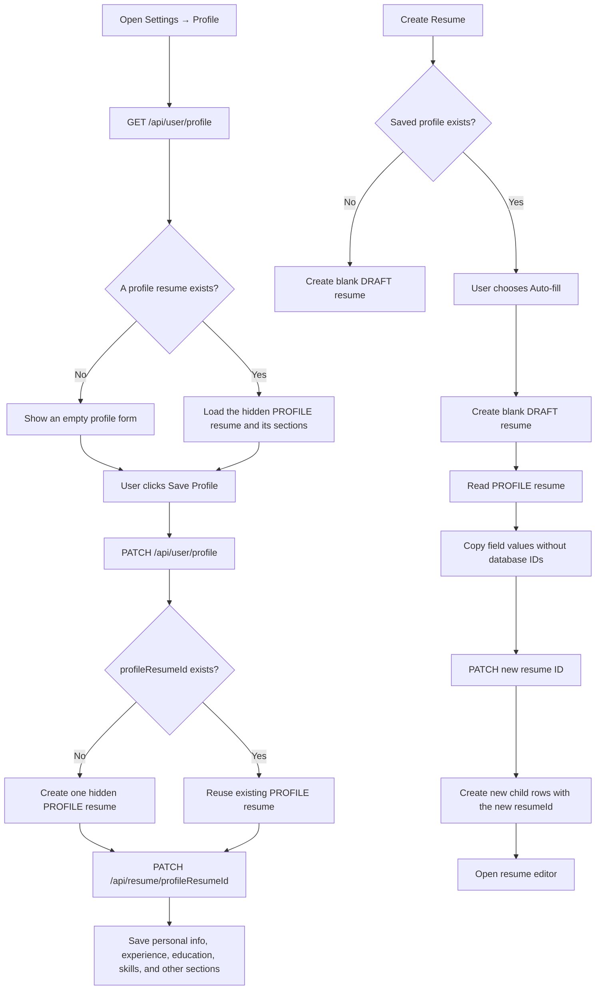

# Career Profile → Resume Import

The profile resume has status `PROFILE` and is excluded from normal resume lists. Import is a one-time snapshot copy: no profile row or section row is shared with an imported resume. Editing either one therefore cannot update the other.
